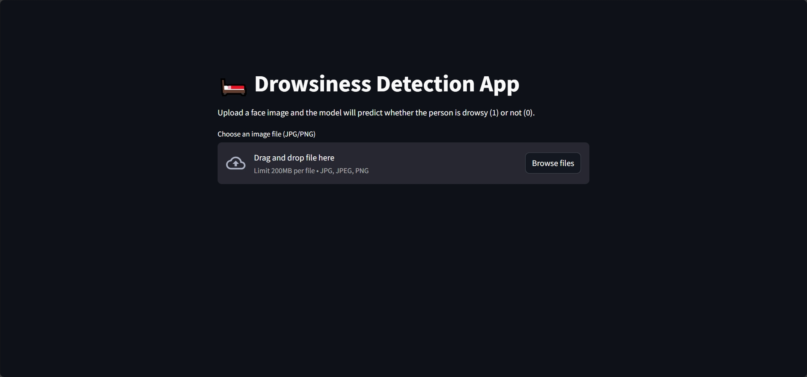
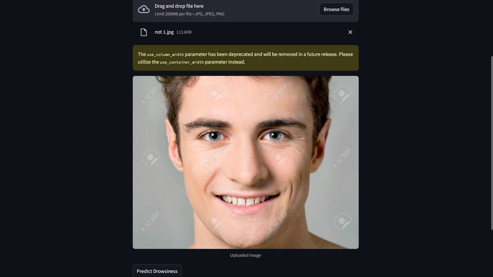

# Drowsy Detector

## About the Project

Drowsy Detector is an end-to-end deep learning solution for detecting driver drowsiness from facial images. The project leverages transfer learning with a pre-trained ResNet50 model, custom data preprocessing, and a user-friendly Streamlit web interface for real-time predictions. It is designed to help improve road safety by providing an automated tool to identify signs of driver fatigue. The repository includes all code, a training and evaluation notebook, and demo media for easy testing and demonstration.

## About the Dataset

This project is built upon the [Drowsiness Prediction Dataset](https://www.kaggle.com/datasets/rakibuleceruet/drowsiness-prediction-dataset) from Kaggle. The dataset contains thousands of labeled facial images of drivers, divided into two categories: "Fatigue Subjects" (drowsy) and "Active Subjects" (alert). Images are collected under various lighting conditions, backgrounds, and driver poses, making the dataset robust and suitable for real-world drowsiness detection. The dataset is organized into folders by class, and each image is labeled for supervised learning. This diversity and structure allow for effective training and evaluation of deep learning models for driver monitoring systems.

## Notebook Summary

The notebook provides a comprehensive, step-by-step workflow for building a deep learning-based driver drowsiness detection system:
- **Data Exploration:** Visualizes the dataset structure, displays sample images from each class, and analyzes class distribution to ensure balanced training.
- **Data Preparation:** Implements a custom PyTorch dataset and DataLoader, applies image preprocessing (resizing, normalization), and uses data augmentation to improve model generalization.
- **Model Architecture:** Utilizes transfer learning with a pre-trained ResNet50 model, adapting its final layers for binary classification and fine-tuning the last few layers.
- **Training Loop:** Sets up the training process with early stopping to prevent overfitting, tracks loss and accuracy metrics, and saves the best-performing model.
- **Evaluation:** Assesses model performance on validation and test sets, visualizes results with confusion matrices, and plots training/validation loss curves for diagnostics.

## Model Results

### Preprocessing
- **Image Resizing:** All images are resized to 224x224 pixels to match ResNet50's input requirements.
- **Normalization:** Images are converted to tensors and normalized to standardize input distributions.
- **Augmentation:** The training set uses augmentations such as random flips and rotations to improve generalization and robustness.

### Training
- **Transfer Learning:** The model uses a pre-trained ResNet50 backbone. All layers are frozen except the last three, which are fine-tuned on the drowsiness dataset.
- **Custom Classifier Head:** The final fully connected layer is replaced with a sequence of linear, ReLU, and dropout layers, ending with a two-class output.
- **Loss Function:** Cross-entropy loss is used for binary classification.
- **Optimizer:** Adam optimizer is employed with a learning rate of 1e-4.
- **Early Stopping:** Training is monitored on the validation set and stops early if validation loss does not improve for several epochs.

### Evaluation
- **Accuracy:** The model achieves up to 96% accuracy on the test set, demonstrating strong performance in distinguishing between drowsy and alert drivers.
- **Confusion Matrix:** The confusion matrix shows high true positive and true negative rates, with minimal misclassifications.
- **Loss Curves:** Training and validation loss curves are plotted to visualize convergence and detect any signs of overfitting or underfitting.

## How to Install

1. **Clone the repository:**
   ```bash
   git clone [<repo-url>](https://github.com/DeepActionPotential/DrowSeeAI)
   cd DrowSeeAI
   ```
2. **Create and activate a virtual environment:**
   ```bash
   python -m venv venv
   # On Windows:
   venv\Scripts\activate
   # On macOS/Linux:
   source venv/bin/activate
   ```
3. **Install dependencies:**
   ```bash
   pip install -r requirements.txt
   ```
   This will install PyTorch, torchvision, Streamlit, Pillow, NumPy, and other dependencies.

4. **Download the dataset:**
   - Download the dataset from [Kaggle](https://www.kaggle.com/datasets/rakibuleceruet/drowsiness-prediction-dataset).
   - Extract it and place it in the appropriate directory as referenced in the notebook.

## How to Use the Software

1. **Demo Application:**
   - The project includes a Streamlit-based web application for real-time drowsiness detection.
   - To launch the demo, run:
     ```bash
     streamlit run app.py
     ```
   - The app allows you to upload an image of a driver and predicts whether the driver is drowsy or alert.

2. **Using Demo Media:**
   - Simply upload any image from the `assets` directory via the web interface and click predict button.
   
   ## [demo-video](assets/drowsy_demo.mp4)

   - **Demo Images:**
       
       
       

3. **Notebook Usage:**
   - Open the notebook in Jupyter or VS Code and run all cells to reproduce the training and evaluation process.
   - You can modify paths and parameters as needed to experiment with different settings.

## Technologies Used

- **PyTorch:** The primary deep learning framework used for model definition, training, and inference. PyTorch provides flexibility for custom dataset handling and model customization.
- **Torchvision:** Supplies pre-trained models (ResNet50), image transforms, and utility functions for computer vision tasks.
- **Pandas & NumPy:** Used for data manipulation, analysis, and efficient numerical computations.
- **Matplotlib:** For visualizing images, loss curves, and confusion matrices during exploration and evaluation.
- **scikit-learn:** Provides metrics such as confusion matrix and accuracy score for model evaluation.
- **Streamlit:** Enables rapid development of interactive web applications for model deployment and demonstration.
- **Pillow:** Used for image loading and processing within the custom dataset class.

These technologies together enable efficient data handling, model training, evaluation, and deployment in a user-friendly interface.

## License

This project is licensed under the MIT License. You are free to use, modify, and distribute this software for personal or commercial purposes, provided that you include the original copyright and license.
